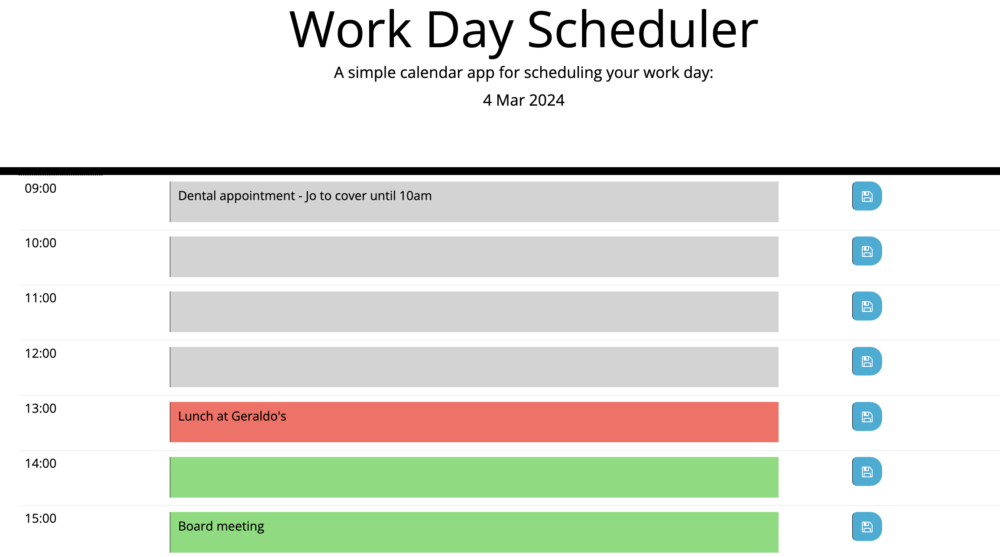

# Working-Day-Scheduler
Calendar app for scheduling diary events in a working day, built as part of Module 7 challenge

# Module 7 challenge

Using starter code, the challenge was to create and deploy a simple app presenting users with a diary-format single page for the current day, consisting of rows for each hour of the working day into which text can be entered as if for appointments/reminders. The background colour of each row needed to dynamically update dependent on whether the relevant hour is in the past, present or future compared to the current time. A button was needed to save text entries to local storage, with code allowing these text entries to persist on page refresh. 

## Installation

N/A

## Usage

https://specialfriendrice.github.io/Working-Day-Scheduler/

https://github.com/SpecialFriendRice/Working-Day-Scheduler

## Credits

Referred to own notes from course and Xpert Learning Assistant/Chat GPT for syntax queries (the latter for DOM parent/child and localStorage code issues). 

## License

MIT Licence, as outlined in the Github repository.